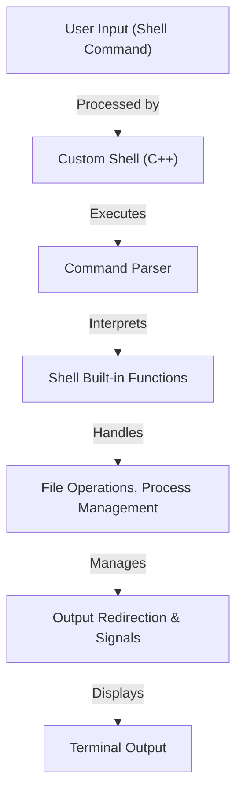

# 🔥 Assignment 2: Shell Script Implementation in C++


---

## 🚀 System Architecture Diagram



---

## **📌 Question 1: Shell Script Implementation**

### **🔹 Overview**
This assignment involves implementing a **custom shell script** using **C++**, supporting multiple shell functionalities such as directory navigation, listing files, running system commands, handling I/O redirection, and signals.

### **✨ Supported Features**

1️⃣ **Custom Shell Prompt**  
   - Displays the shell prompt in the format:
     ```
     username@system_name:current_directory>
     ```

2️⃣ **Directory Navigation Commands**  
   - `cd <directory>` → Change working directory.
   - `pwd` → Display current directory.

3️⃣ **Printing & Echo**  
   - `echo <message>` → Print message to terminal.

4️⃣ **Listing Files (`ls` Command)**  
   Supports various options:
   ```
   ls        → List files in directory
   ls -a     → Show hidden files
   ls -l     → Detailed file information
   ls -al    → Combination of `-a` and `-l`
   ls ~      → List home directory
   ls .      → List current directory
   ls ..     → List parent directory
   ```

5️⃣ **System Commands Execution**  
   - Runs system commands with or without arguments.
   - Supports **foreground (`fg`) and background (`&`) execution**.

6️⃣ **Search Functionality**  
   - Allows searching for files or patterns within directories.

7️⃣ **I/O Redirection**  
   - Handles redirection of input/output using `>` and `<` operators.

8️⃣ **Signal Handling**  
   - Supports simple signal handling (e.g., `CTRL+C` interruption handling).

---

## 🎯 **Execution**
1️⃣ **Compile the C++ Shell Program:**
```bash
g++ shell.cpp -o myShell
```

2️⃣ **Run the Shell:**
```bash
./myShell
```

3️⃣ **Enter Commands:**
```bash
username@system_name:current_directory> ls -l
username@system_name:current_directory> cd Documents
username@system_name:current_directory> echo "Hello, Shell!"
```

---

## 📌 **Assumptions**
✔️ The user provides **valid input** (e.g., correct file paths & valid arguments).  
✔️ The system environment supports **POSIX shell commands**.  
✔️ The shell program is executed **inside a Linux/Unix terminal**.  

---

## 📸 **Application Snapshots**

### 🖥️ Custom Shell Prompt in Action


### 📂 Listing Files using `ls`


### 🏗️ Process Execution (Foreground & Background)


### 🔄 I/O Redirection


---

## 💡 **Future Enhancements**
✨ **Support for Advanced Piping (`|` operator)**.  
✨ **Enhanced Auto-Completion for Commands**.  
✨ **Improved Error Handling for Invalid Commands**.  
✨ **History Tracking for Previously Executed Commands**.  

---

## 📞 **Contact & Contribution**

🤝 Want to contribute? Fork the repo and submit a PR!  
📩 **Contact:** [Your Email Here](mailto:your-email@example.com)  
🚀 **GitHub Repository:** [Custom C++ Shell](https://github.com/your-github-username/custom-shell)

---

Now, your **shell script project** has a **beautiful, well-structured, and recruiter-attracting** `README.md`. 🚀🔥 Let me know if you need any refinements!
